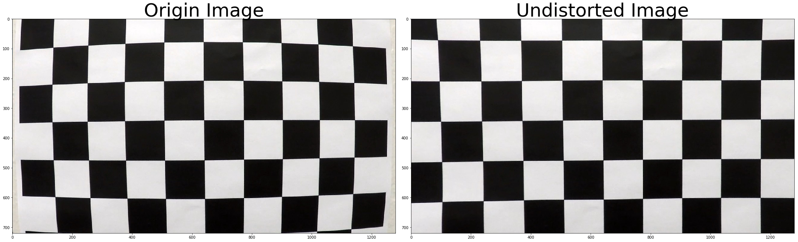
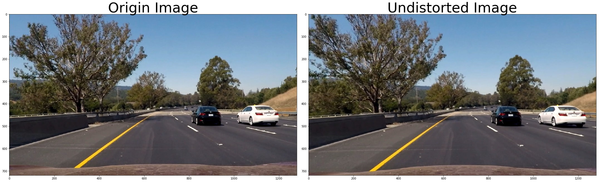
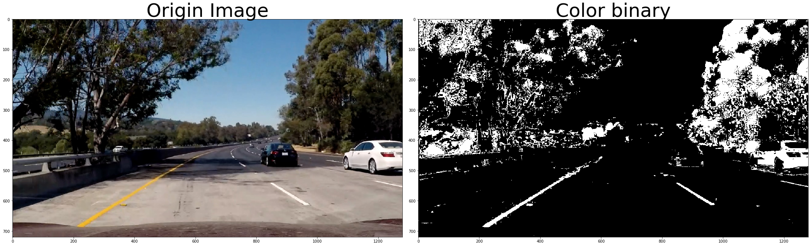
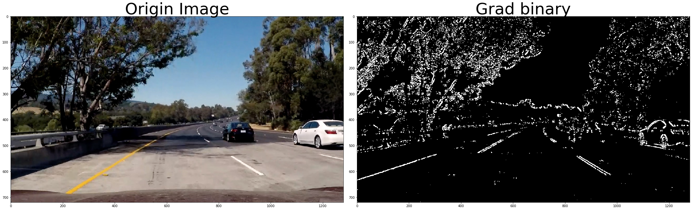
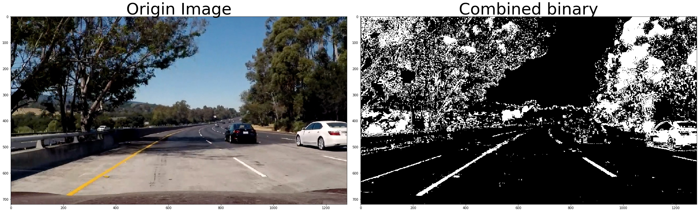
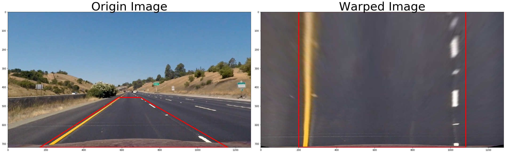
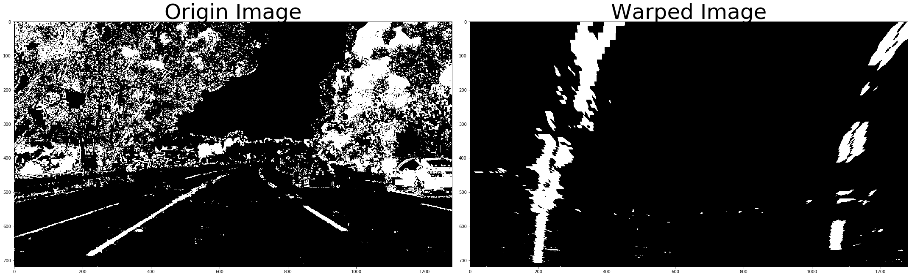
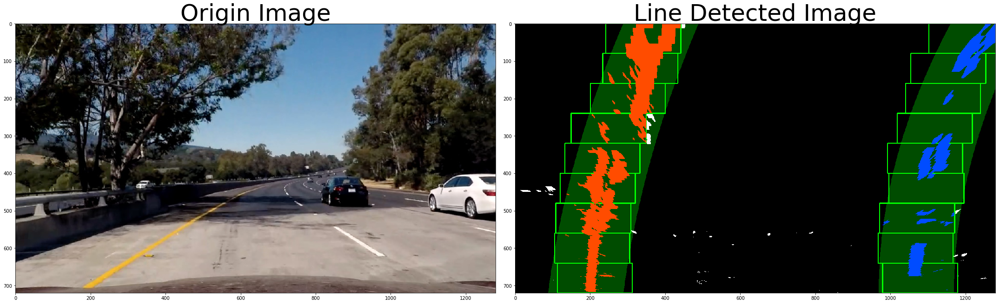
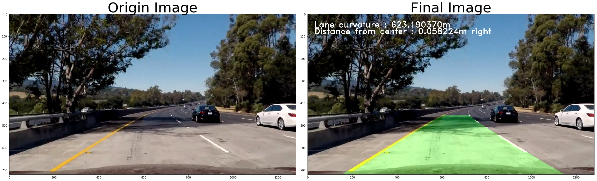

# Advanced Lane Finding Project


## Introduction

This is a advanced version of [Lane Finding Project][].

The goals / steps of this project are the following:

- Compute the camera calibration matrix and distortion coefficients given a set of chessboard images.
- Apply a distortion correction to raw images.
- Use color transforms, gradients, etc., to create a thresholded binary image.
- Apply a perspective transform to rectify binary image ("birds-eye view").
- Detect lane pixels and fit to find the lane boundary.
- Determine the curvature of the lane and vehicle position with respect to center.
- Warp the detected lane boundaries back onto the original image.
- Output visual display of the lane boundaries and numerical estimation of lane curvature and vehicle position.

[Lane Finding Project]: https://github.com/earlbread/CarND-LaneLines-P1

## Process steps

Load the required modules and define the functions to proceed with each step.


```python
import cv2
import numpy as np
import matplotlib.pyplot as plt
import matplotlib.image as mpimg

%matplotlib inline
%load_ext autoreload
%autoreload 2
```

    The autoreload extension is already loaded. To reload it, use:
      %reload_ext autoreload


```python
def show_processed_image(origin, processed, processed_title='Processed'):
    fig, (ax1, ax2) = plt.subplots(1, 2, figsize=(30, 20))
    fig.tight_layout()
    
    ax1.imshow(origin, cmap='gray')
    ax1.set_title('Origin Image', fontsize=50)
    
    ax2.imshow(processed, cmap='gray')
    ax2.set_title(processed_title, fontsize=50)
    
    plt.show()
```

### 1. Calculate Camera Calibration and Correct Distortion

Image distortion occurs when a camera looks at 3D objects in the real world and transforms them into a 2D image; this transformation isn’t perfect. Distortion actually changes what the shape and size of these 3D objects appear to be. So, the first step in analyzing camera images, is to undo this distortion so that you can get correct and useful information out of them.

To get calibration info, I used given 20 chessboard images.


```python
import calibration as calib

nx = 9
ny = 6
mtx, dist = calib.get_calibration_info('./camera_cal/', nx, ny)
```

A sample chessboard image and corresponding undistorted image.


```python
origin1 = mpimg.imread('./camera_cal/calibration1.jpg')
undistorted1 = calib.undistort_image(origin1, mtx, dist)

show_processed_image(origin1, undistorted1, processed_title='Undistorted Image')
```





A sample raw image and corresponding undistorted image.


```python
origin2 = mpimg.imread('./test_images/test6.jpg')
undistorted2 = calib.undistort_image(origin2, mtx, dist)

show_processed_image(origin2, undistorted2, processed_title='Undistorted Image')
```





### 2. Create thresholded image

To detect lane lines, we need to create binary image using color and gradient threshold.

#### 1. Color Thresholding


```python
import thresholding
image = mpimg.imread('./test_images/test5.jpg')

s_image = thresholding.color_combine(image)
show_processed_image(image, s_image, processed_title='Color binary')
```





#### 2. Gradient thresholding


```python
import thresholding
image = mpimg.imread('./test_images/test5.jpg')

s_image = thresholding.grad_combine(image)
show_processed_image(image, s_image, processed_title='Grad binary')
```





#### 3. Combining result


```python
import thresholding
image = mpimg.imread('./test_images/test5.jpg')

s_image = thresholding.thresh_combine(image)
show_processed_image(image, s_image, processed_title='Combined binary')
```





### 3. Apply Perspective Transform

bird’s-eye view transform that let’s us view a lane from above; this will be useful for calculating the lane curvature later on.


```python
import perspective

image = mpimg.imread('./test_images/straight_lines1.jpg')
image = calib.undistort_image(image, mtx, dist)

src = np.float32([[(167, 720),
                   (585, 453),
                   (698, 453),
                   (1160, 720)]])

dst = np.float32([[(200, 720),
                   (200, 0),
                   (1080, 0),
                   (1080, 720)]])

warped = perspective.perspective_transform(image)

cv2.polylines(image, np.int_([src]), True, (255, 0, 0), 3)
cv2.polylines(warped, np.int_([dst]), True, (255, 0, 0), 3)

show_processed_image(image, warped, processed_title='Warped Image')
```





```python
import thresholding
import perspective

image = mpimg.imread('./test_images/test5.jpg')

thresholded = thresholding.thresh_combine(image)
warped_thresholded = perspective.perspective_transform(thresholded)

show_processed_image(thresholded, warped_thresholded, processed_title='Warped Image')
```





### 4. Detect Lane Pixels

We can using sliding window search to detect lane lines.


```python
import laneline
import perspective

image = mpimg.imread('./test_images/test5.jpg')
image = calib.undistort_image(image, mtx, dist)

binary = thresholding.thresh_combine(image)
binary_warped = perspective.perspective_transform(binary)

detected, ploty, leftx, rightx, left_fitx, right_fitx, curvature, dist_center = laneline.sliding_window(binary_warped)

show_processed_image(image, detected, processed_title='Line Detected Image')
```





### 5. Warp back the detected lane boundaries and lane info

The last step is drawing lane boundaries to original image.


```python
import laneline
import perspective

prev_left = None
prev_right = None

image = mpimg.imread('./test_images/test5.jpg')
image = calib.undistort_image(image, mtx, dist)

binary = thresholding.thresh_combine(image)
binary_warped = perspective.perspective_transform(binary)

detected, ploty, leftx, rightx, left_fitx, right_fitx, curvature, dist_center = laneline.sliding_window(binary_warped)

mapped_lane, prev_left, prev_right = perspective.fill_laneline(image, binary_warped, ploty, left_fitx, right_fitx, prev_left, prev_right)
result = laneline.add_line_info(mapped_lane, curvature, dist_center)

show_processed_image(image, result, processed_title='Final Image')
```




## Result and Thoughts

[](https://www.youtube.com/watch?v=qhv-Vaw1V64)

- My pipeline doesn't work well in challenge videos. To make the pipeline more robust, more parameter tuning is needed.

- To make debugging easier, I need to make diagnosis video.

- For an additional improvement, I need to implement outlier rejection and use a low-pass filter to smooth the lane detection over frames.
